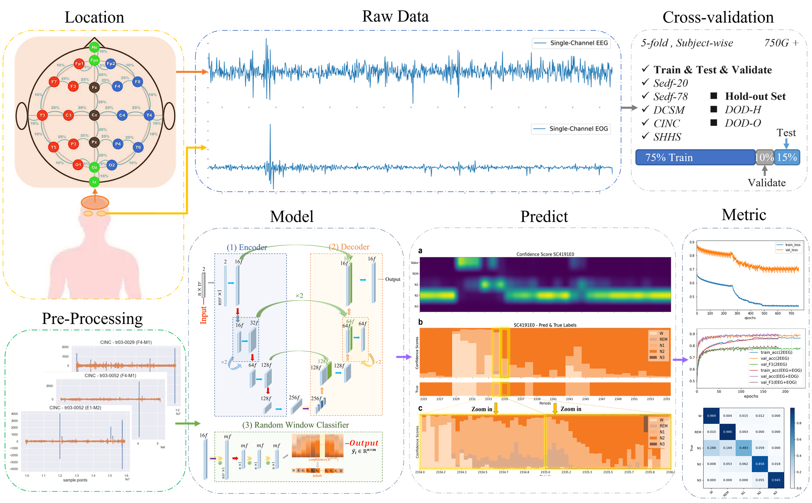
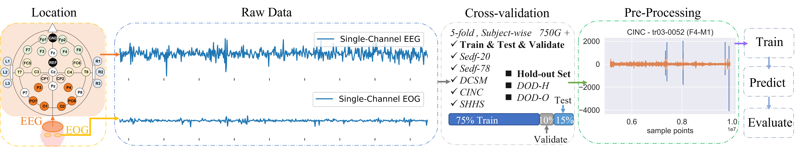
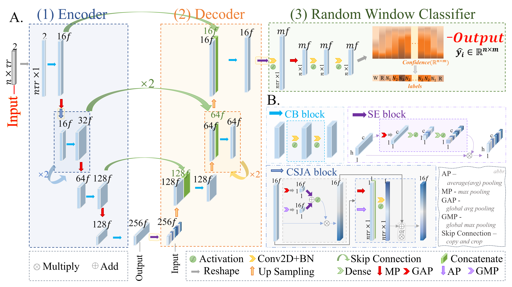
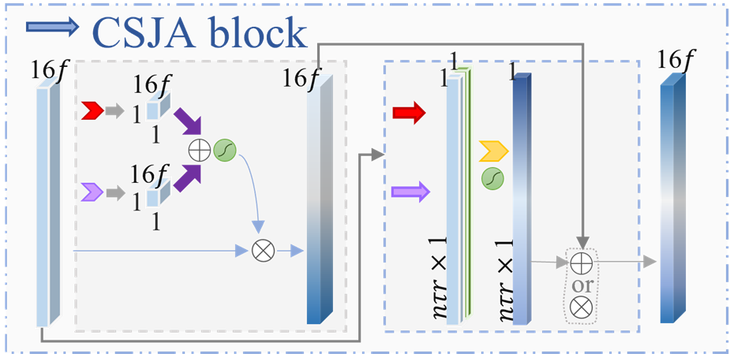
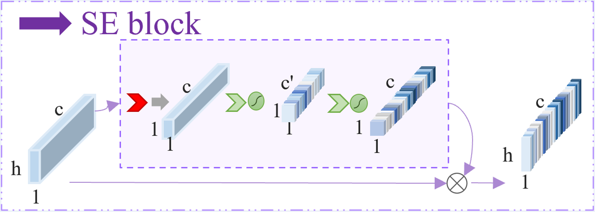
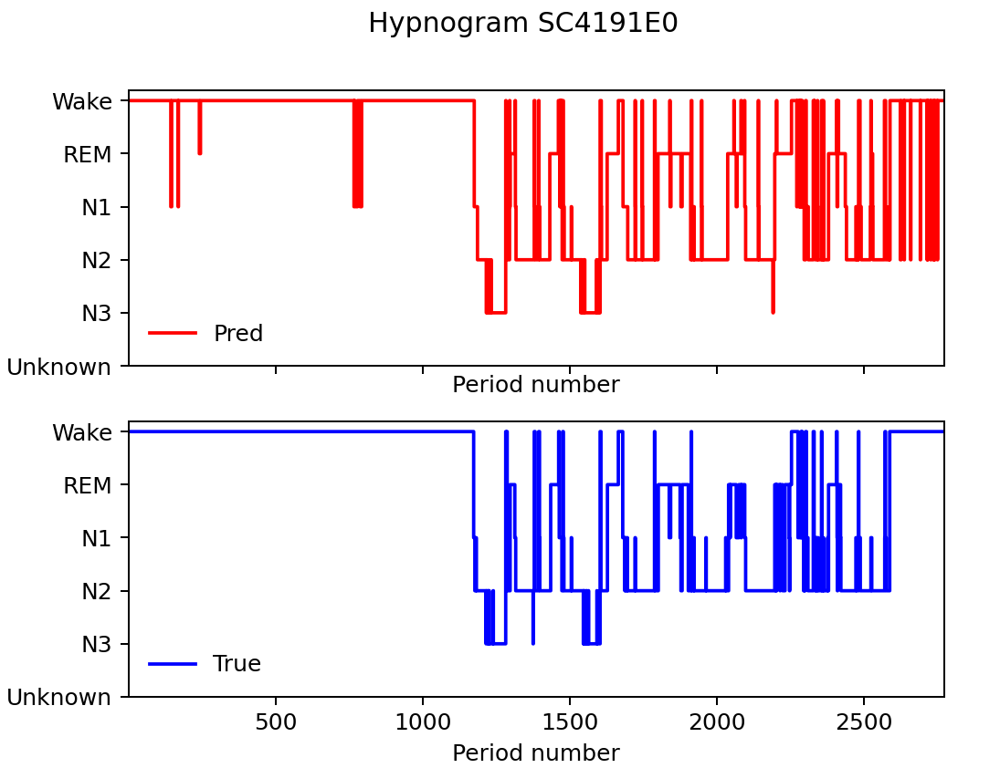
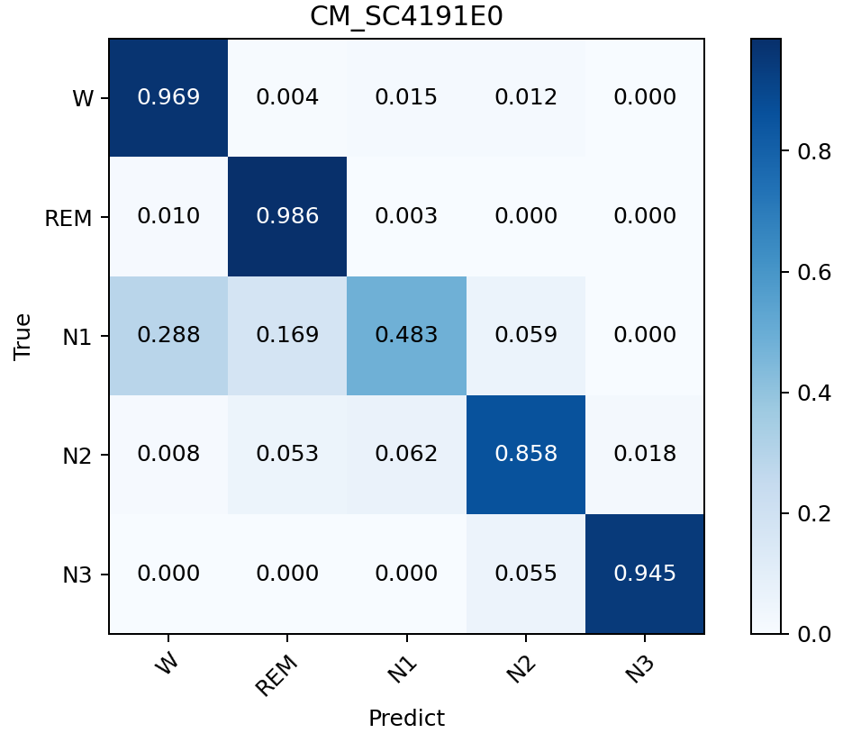
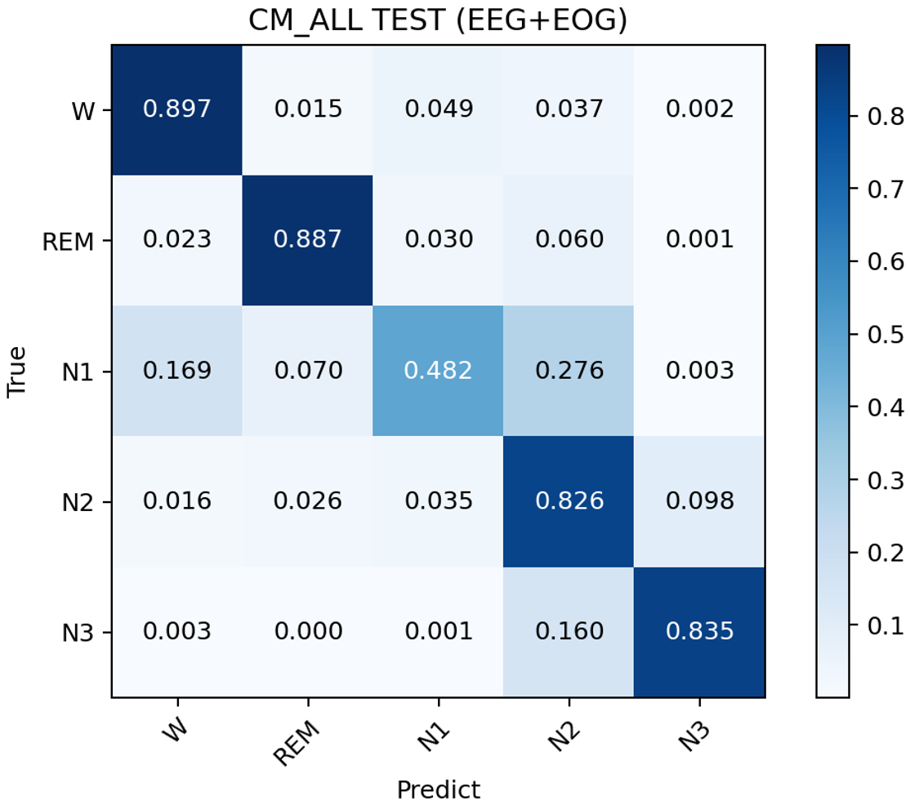

# TinyUStaging

### TinyUStaging: An Efficient Model for Sleep Staging with Single-Channel EEG and EOG

- See HD figure in `supplementary_materials\Figures\FigS1.tif`

#### Codes

- The source code will be made public after the paper is accepted. 
  - The model framework has been open sourced, see `bin/defaults`

- Welcome to submit issues to promote my work!

#### Workflow

- Schematic illustration of our TinyUStaging workflow

  

  - **Data.** We selected any combination of 'EEG+EOG'. 
  - **Cross-validation**. we applied *5-fold subject-wise cross-validation* on seven datasets totaling above 750G, in each fold, *75%, 10%, and 15%* of the data were utilized to train, validate and evaluate the model. 
  - **Pre-Processing.** We conducted data scaling and data enhancement methods to make the model more robust. 
  - **Model.** We trained a 4-layer U-Net including Encoder, Decoder and Random Window Classifier (RWC) with SE and CSJA module. 
  - **Predict.** We output the confidence scores of each class in the entire RWC. 
  - **Evaluate.** TinyUStaging use metrics including per-class metrics and overall metrics (*accuracy, precision, recall, F1-Score, Cohen’s kappa*). 

#### Model Architecture

##### Overall 

###### CSJA block

###### SE block

#### Results

##### Subject-wise

- See `supplementary_materials\paper_plot`
- *e.g.* Case **SC4191E0** in **Sleep-EDF**
  - 
  - 

##### Dataset-wise

- This will be made public after the paper is accepted. 

##### All Test Sets

- Results with seven **highly heterogeneous**

  - ###### 

  - For more visualization results, see our paper and project folders `supplementary_materials`

